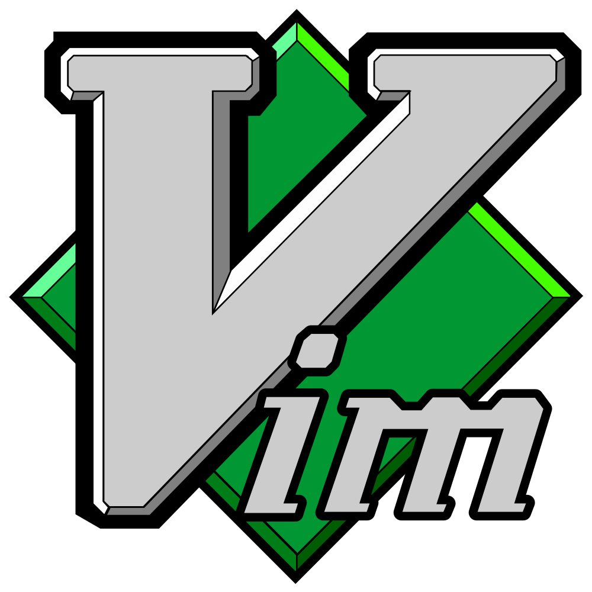
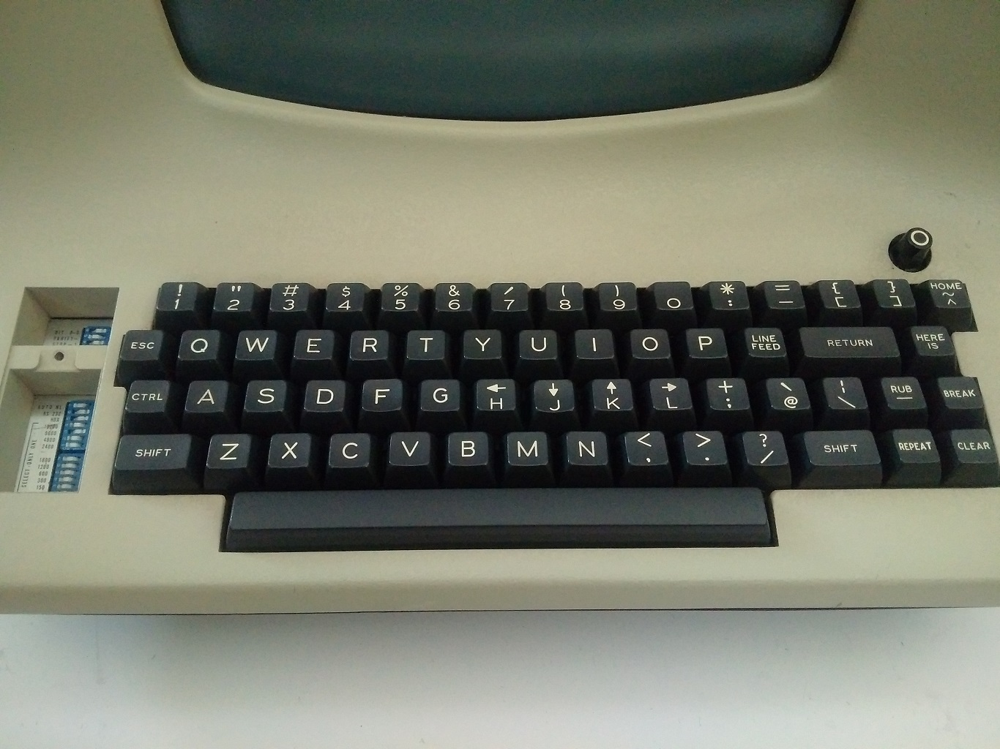

---
title: Getting Started with Vim
author: Sean
patat:
  wrap: true
  slideLevel: 2
  images:
    backend: auto
  theme:
    header: [bold, vividCyan]
    bulletList: [dullCyan]
    emph: [dullWhite, italic]
  margins:
    left: 5
    right: 5
  pandocExtensions:
    - patat_extensions
    - autolink_bare_uris
...


## xkcd


##logo



# Intro

## Agenda

* A brief history of VIM
* Why VIM
* Understanding the philosophy
* Basic VIM
* Touch on more advanced topics
* How to make VIM your own
* Q & A... If time permits

## A brief history of VIM

```
|--QED
|     |_1965-1966
|     |_UC Berkeley
|
|--ed
|     |_1969
|     |_Bell Labs
|     |_Ken Thompson and Dennis Ritchie
|
|--em
|     |_"editor for mortals"
|     |_1975
|     |_Queen Mary’s College, London
|     |_George Coulouris
|
|--ex/vi
|     |_"extended ed"
|     |_1978
|     |_UC Berkeley
|     |_Bill Joy
|     |_Distributed with BSD Unix Version 1.1
|
|--vim
|     |_"Vi Imitation" later "Vi Improved"
|     |_1988
|     |_Bram Moolenaar
|
|--neovim
|     |_2014
|
|--vim 8
|     |_2016
```


[Where Vim Came From]<https://twobithistory.org/2018/08/05/where-vim-came-from.html>

## adm3a keyboard



# Why VIM

## Pros
* Fast and Lightweight
* More productivity with less typing
* Customizable
* Free
* Portable
* Fun

## Cons
* Steep learning curve
* Default configurations sucks
* Doesn't have a _"modern"_ look and feel
* System clipboard support is not always easy

# Vim Philosophy

## Vim is a Modal editor

| mode    | commands     |
| ---     | ---:         |
| normal  | <ESC> <C-[>  |
| insert  |  i I a A o O |
| command | :            |
| visual  | v V <C-v>    |


## Vim Grammar

{modifier}(operator)[motion/text-object]

. . .

```
3dw
```
delete 3 words

. . .
```
=G
```
re-indent lines from current position to end of file

# Learning resources

## Vim help & Built in resources

```
:help {topic}
```

`<C-]>` - navigate to tag under cursor
`<C-t>` - navigate back from tag
 ``
 ``

Opens a quick self guided tour of basic vim commands

`$ vimtutor`

## Additional Resources

* Seven habits of effective text editing - https://www.moolenaar.net/habits_2007.pdf
* video tutorials - http://vimcasts.org/
* Vim Galore - https://github.com/mhinz/vim-galore
* Awesome Vim - https://github.com/akrawchyk/awesome-vim
* Vim Adventures(paid after first level) - https://vim-adventures.com/
* youtube - https://youtube.com

## Cheat sheet 1


## Cheat sheet 2


# Basic VIM

## Movements
```
:help motion.txt
```

### Single Character

| | |
|---|---: |
| h | left |
| j | down |
| k | up |
| l | right |

## Movements
```
:help motion.txt
```

### By word

A word consists of a sequence of letters, digits and underscores, or a
sequence of other non-blank characters, separated with white space (spaces,
tabs, <EOL>).

A WORD consists of a sequence of non-blank characters, separated with white
space.  An empty line is also considered to be a WORD.

http://google.com = 5 words or 1 WORD

| | |
| --- | ---: |
| w | forward to next word |
| W | forward to next WORD |
| e | forward to end of word |
| E | forward to end of WORD |

| | |
| --- | ---: |
| b | backwards to previous word |
| B | backwards to previous WORD |
| ge | backwards to previous end of word |
| gE | backwards to previous end of WORD |

## Movements
```
:help motion.txt
```

### find and til

Works only on current line

| | |
|---|---: |
| f{char} | forward to {char} |
| F{char} | backwards to {char} |
| t{char} | forward until {char} |
| T{char} | backwards until {char} |
| ; | repeat last find command is same direction |
| , | repeat last find command is opposite direction |

## Movements
```
:help motion.txt
```

### search

Works on whole file

| | |
|---|---: |
| /{word} | search forwards for word |
| ?{word} | search backwards for word |
| * | search forwards for word under cursor |
| # | search backwards for word under cursor |
| n | continue search in same direction |
| N | continue search in opposite direction |

## Movements
```
:help motion.txt
```

### Navigating a file

| | |
|---|---: |
| {n}G | Goto to line number {n} |
| gg | Goto to first line of file |
| G | Goto to end of file |
| <C-d> | jump down half a page |
| <C-u> | jump up half a page |
| <C-f> | scroll page down(forward) 1 full page |
| <C-b> | scroll page up(back) 1 full page |
| zz | center buffer on current position |
| H | move cursor to top of screen |
| M | move cursor to middle of screen |
| L | move cursor to bottom of screen |

## Movements
```
:help motion.txt
```

<!-- &#124; is a | operator -->

| | |
|---|---: |
| 0 | to column 0 |
| ^ | to first non-blank char |
| $ | to end of line |
| {n}&#124; | to column number {n} |
| % | to matching bracket |

## Insert Mode
```
:help inserting
```

| | |
|--- | --- |
| i | insert before current position |
| a | append after current position |
| I | insert before first non-blank character on current line |
| A | append after last blank character on current line |
| o | insert line after current position and enter insert mode |
| O | insert line before current position and enter insert mode |

Always use ESC or <C-[> to return to normal mode

## Commands
```
:help change.txt
```

| | |
| --- | --- |
| x | delete character |
| r | replace character |
| ~ | toggle case |

## Operators
```
:help operator
```

| | |
|--- | --- |
| y | yank(copy) text |
| d | delete text |
| c | change text |
| < | un-indent text |
| > | indent text |
| gu | make text lowercase |
| gU | make text uppercase |

## The dot operator
```
:help single-repeat
```

dot ( . ) repeats the last command

## Text Objects - In and Around
```
:help text-objects
```

Move be prepended by a command

Can include:

Braces/parentheses

* ()
* {}
* []
* <>

Quotes and backticks

* "
* '
* `

Tags -> <a></a>

* t

Words/WORDS/sentances/paragraphs

* w
* W
* s
* p

ci{ -> Change contents in curly brace

dit -> Delete contents in xml/html tag

yaw -> Yank contents around current word including trailing whitespace

## Undo/Redo

| | |
|--- | --- |
|u | undo |
|<C-r> | redo |

# "Advanced" Vim

## Marks
```
:help marks
```

Marks can be a-z or A-Z

mg -> set mark named g to current position

`g -> goto mark g

'g -> goto the start of the line of mark g

automatic marks

| | |
| --- | --- |
| ` | the cursor position before the last jump |
| [ | the first character of the last yanked or changed text |
| ] | the last character of the last yanked or changed text |
| . | the position where the last change was made |

## Vim Registers
```
:help registers
```

named regisers can be a-z


```
:registers
```
to view the list of current registers

To specify a register prepend with `"`

```
"oy$
"op
```
common unnamed registers are

| | |
|--- | --- |
|"| text from the most recent d, c, s, x or y command|
|+| the system clipboard register, is configured |
|0| the text from the most recent yank command not stored in another register |
|1-9| contains the text from the most recent delete or change command |
|_| the black hole register used to preserve numbered registers |
|/| the last search register |
|:| the last ex command ran |


## Marcos
```
:help complex-repeat
```

q{char} starts recording into registar {char}

press q again to stop recording

macros are stored in the registars

# Customizing VIM

## .vimrc

```
set number
set syntax
```

# Conclusion

# FAQ
