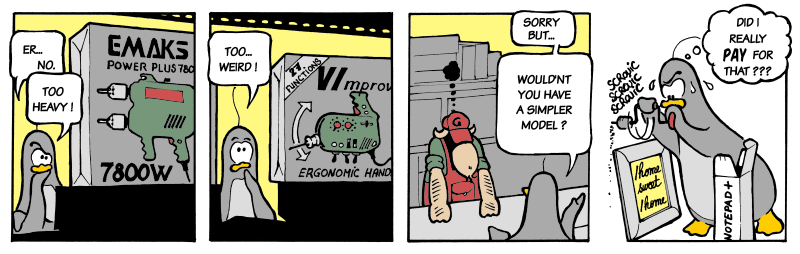
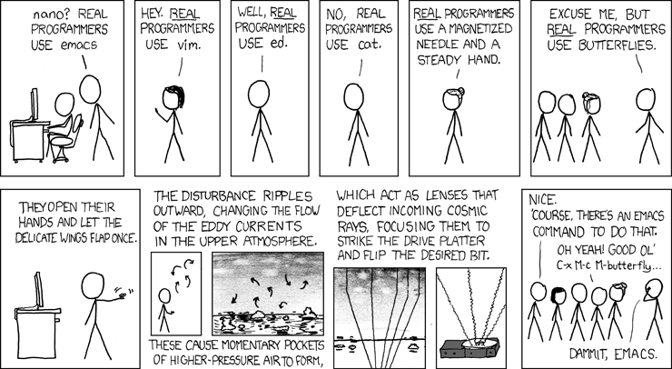

---
title: Getting Started with Vim
patat:
  wrap: true
  slideLevel: 2
  images:
    backend: auto
  theme:
    header: [bold, vividCyan]
    bulletList: [dullCyan]
    emph: [dullWhite, italic]
    codeBlock: [onDullBlack]
  margins:
    left: 5
    right: 5
  pandocExtensions:
    - patat_extensions
    - autolink_bare_uris
...


## VIM is weird



## xkcd



## logo


# Intro

## Agenda

* Why this topic
* A brief history of VIM
* Why VIM
* Understanding the philosophy
* How to make VIM your own
* Basic VIM
* Touch on more advanced topics
* Q & A... If time permits

## Why this talk

. . .

### How to Exit VIM

[Stack Overflow: Helping One Million Developers Exit Vim]<https://stackoverflow.blog/2017/05/23/stack-overflow-helping-one-million-developers-exit-vim/>

## stack overflow


## exit vim meme


## exit tweet


## exit book


## Command Mode

### How to Exit VIM


```
  :help write-quit
```

|                  |                                                            |
| ---------------- | ---                                                        |
| `:q` `:quit`     | quit                                                       |
| `:q!` `quit!`    | force quit                                                 |
| `:qa` `:quitall` | quit and close all open buffers                            |
| `:wq`            | write file and quit                                        |
| `:wq!`           | write and quit, if file does not have a name fail and quit |
| `:x` `:exit`     | write file only if file has been changes and quit          |
| `:xa` `:xall`    | same as `:x` but run on all open buffers                   |
| `:xa!` `:xall!`  | same as `:xa` but exit even on errors                      |
| `:cq` `:cquit`   | quit and return a none 0, helpful on git commit            |


## A brief history of VIM

```
|--QED
|     |_1965-1966
|     |_UC Berkeley
|
|--ed
|     |_1969
|     |_Bell Labs
|     |_Ken Thompson and Dennis Ritchie
|
|--em
|     |_"editor for mortals"
|     |_1975
|     |_Queen Mary’s College, London
|     |_George Coulouris
|
|--ex/vi
|     |_"extended ed"
|     |_1978
|     |_UC Berkeley
|     |_Bill Joy
|     |_Distributed with BSD Unix Version 1.1
|
|--vim
|     |_"Vi Imitation" later "Vi Improved"
|     |_1988
|     |_Bram Moolenaar
|
|--neovim
|     |_2014
|
|--vim 8
      |_2016
```

<!-- comment -->

[Where Vim Came From]<https://twobithistory.org/2018/08/05/where-vim-came-from.html>

## Ken Thompson and Dennis Ritchie


## A brief history of VIM

```
|--QED
|     |_1965-1966
|     |_UC Berkeley
|
|--ed
|     |_1969
|     |_Bell Labs
|     |_Ken Thompson and Dennis Ritchie
|
|--em
|     |_"editor for mortals"
|     |_1975
|     |_Queen Mary’s College, London
|     |_George Coulouris
|
|--ex/vi
|     |_"extended ed"
|     |_1978
|     |_UC Berkeley
|     |_Bill Joy
|     |_Distributed with BSD Unix Version 1.1
|
|--vim
|     |_"Vi Imitation" later "Vi Improved"
|     |_1988
|     |_Bram Moolenaar
|
|--neovim
|     |_2014
|
|--vim 8
      |_2016
```

<!-- comment -->

[Where Vim Came From]<https://twobithistory.org/2018/08/05/where-vim-came-from.html>

## adm3a keyboard


# Why VIM

## Pros
* Fast and Lightweight
* Portable
* Customizable
* Open-source
* Fun

<!-- fast and lightweight/more productive: was designed to work on a slow connection with the least amount of inputs -->
<!-- Customizable: can make it as close to an ide as you would like. Any key can be mapped and can be styled in anyway you like -->
<!-- free: charityware. Supports children in Uganda -->
<!-- portable: available on every os even android and ios(not very practical on mobile). Key binding on other app like browsers because of vimium  -->
<!-- fun: vim golf - try to preform action in fewest commands possible -->

## Cons
* Steep learning curve
* Default configurations sucks
* Doesn't have a _"modern"_ look and feel
* System clipboard support is not always easy

## Vim Philosophy

### Vim is a Modal editor

| mode    | commands     |
| ---     | ---:         |
| normal  | <ESC> <C-[>  |
| insert  |  i I a A o O |
| command | :            |
| visual  | v V <C-v>    |

. . .

> “Indeed, the ratio of time spent reading versus writing is well over 10 to 1. We are constantly reading old code as part of the effort to write new code. ...[Therefore,] making it easy to read makes it easier to write.”

― Robert "Uncle Bob" Martin, Clean Code: A Handbook of Agile Software Craftsmanship

## Vim Philosophy

### Vim Grammar

(operator)[motion/text-object]

. . .

```
dw
```
delete word

. . .
```
=G
```
re-indent lines from current position to end of file

## Learning resources

### Vim help & Built in resources

```
$ vimtutor
```

Opens a quick self guided tour of basic vim commands

. . .
```
:help {topic}
```

`<C-]>` - navigate to tag under cursor
`<C-t>` - navigate back from tag
 ``
 ``

## Learning resources

### Additional Resources

* Awesome Vim - https://github.com/akrawchyk/awesome-vim
* Seven habits of effective text editing - https://www.moolenaar.net/habits_2007.pdf
* video tutorials - http://vimcasts.org/
* Vim Galore - https://github.com/mhinz/vim-galore
* Awesome Vim(plugin explorer) https://vimawesome.com
* Vim Adventures(paid after first level) - https://vim-adventures.com/
* Practical Vim Book

## Cheat sheet 1


## Cheat sheet 2


## beautiful cheat sheet


# Customizing VIM

## .vimrc
```
:help vimrc
```

Normally located at
macOS/Linux
~/.vimrc for vim or ~/.config/nvim/init.vim for neovim

windows
$HOME/\_vimrc

To load a different vimrc start vim with the -u flag passing it the file you would like to load
```
vim -u vimrc
```
or
```
vim -u NONE
```

## plugin managers

* [vim-plug](https://github.com/junegunn/vim-plug)
* [pathogen](https://github.com/tpope/vim-pathogen)
* [vundle](https://github.com/VundleVim/Vundle.vim)

# Basic VIM

# Conclusion

# Q&A
